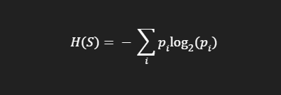
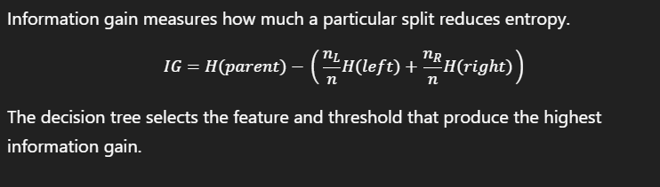

# Decision Tree From Scratch ??

This project builds a decision tree classifier from scratch using NumPy and compares it against scikit-learn's `DecisionTreeClassifier` on the Iris dataset.

The goal is to understand the core mechanics of decision trees: entropy, information gain, recursive splitting, leaf prediction, and stopping criteria.

## Project Overview

A decision tree is a supervised learning model that repeatedly splits the dataset into smaller subsets based on feature thresholds. The split that produces the largest reduction in class impurity is chosen at each node.

In this project, the custom implementation follows this flow:

1. Load the Iris dataset
2. Split into train/test sets
3. Compute entropy for a label set
4. Try feature-threshold splits
5. Compute information gain
6. Select the best split
7. Recursively build left and right subtrees
8. Create leaf nodes when the tree should stop
9. Predict on new samples
10. Compare the custom model with scikit-learn

## Learning Goals

- Understand entropy and classification impurity
- Learn how information gain drives split selection
- Implement recursive tree-building logic from scratch
- Understand stopping conditions and overfitting risks
- Compare a custom model with a production-quality reference implementation
- Practice evaluating classification results with standard metrics

## Concepts Covered

### Entropy

Entropy measures uncertainty in a set of class labels.

For a set of class probabilities $p_i$, entropy is:

$$
H(S) = -\sum_i p_i \log_2(p_i)
$$



A pure set has low entropy, while a balanced mix has higher entropy.

### Information Gain

Information gain measures how much a split reduces uncertainty:

$$
IG = H(parent) - \sum_{child} \frac{|child|}{|parent|} H(child)
$$



The tree tries to choose the split that maximizes this value.

### Recursive Splitting

After a split is chosen, the process repeats on each child subset until a stopping condition is reached.

### Leaf Nodes

A leaf predicts the majority class in that subset. This is the final decision used for prediction.

### Stopping Conditions

The custom tree stops splitting when one of the following applies:

- maximum depth is reached
- too few samples remain
- all labels in the node are the same
- no valid split provides positive gain

## Dataset

This project uses the Iris dataset from `sklearn.datasets`.

It contains:

- 150 samples
- 4 numerical features
- 3 classes

Features:

- sepal length
- sepal width
- petal length
- petal width

Classes:

- Setosa
- Versicolor
- Virginica

## Project Structure

```text
Decision Tree From Scratch/
+-- README.md
+-- assets/
�   +-- DT_1.png
�   +-- InformationGain.png
+-- notebook/
�   +-- ML_DecisionTree.ipynb
+-- .venv/
```

## Environment Setup

From the workspace root:

```bash
python -m venv .venv
.venv\Scripts\activate
pip install numpy matplotlib scikit-learn
```

## Run the Notebook

Open the notebook in VS Code or Jupyter and run the cells in order:

```text
notebook/ML_DecisionTree.ipynb
```

The notebook includes:

- dataset loading
- train/test split
- entropy function
- split logic
- information gain computation
- best split search
- tree node definition
- recursive tree construction
- prediction method
- accuracy and classification report
- comparison with scikit-learn
- visualizations

## Core Implementation

The model is implemented as a custom class with:

- `fit(X, y)`
- `_build_tree(...)`
- `_most_common_class(...)`
- `predict(X)`

The training logic keeps selecting the feature/threshold pair that gives the highest information gain until the stopping conditions are met.

## Evaluation

The model is measured using:

- accuracy
- precision
- recall
- F1-score
- classification report by class

It is then compared with scikit-learn's built-in `DecisionTreeClassifier` using the same train/test split.

## Why This Project Matters

This project is intentionally educational rather than production-ready. It helps explain what happens under the hood in a decision tree model and why libraries like scikit-learn are faster and more robust.

It also highlights a key idea in machine learning:

- a simple algorithm can be implemented from scratch
- the same logic can be optimized and generalized in a library later

## Key Takeaways

- Decision trees split data recursively based on feature thresholds
- Entropy is a measure of impurity
- Information gain chooses the most informative split
- Very deep trees can overfit the training data
- Feature scaling is generally not required for decision trees
- A custom implementation is useful for understanding the algorithm before relying on libraries

## Limitations

This version is intentionally simplified and does not include:

- pruning
- Gini impurity
- regression trees
- categorical feature handling
- missing value handling
- class weights
- optimized split-search
- production-grade performance tuning

## Suggested Next Steps

Possible improvements for future versions:

- add Gini impurity
- support pruning
- compare depth values and overfitting behavior
- visualize the built tree structure directly
- add feature importance analysis
- extend to regression trees

## Conclusion

This notebook is a strong beginner-to-intermediate ML project for understanding one of the most intuitive supervised learning algorithms. It sits well in a broader portfolio of classical machine learning projects and helps connect theory to code in a practical way.
